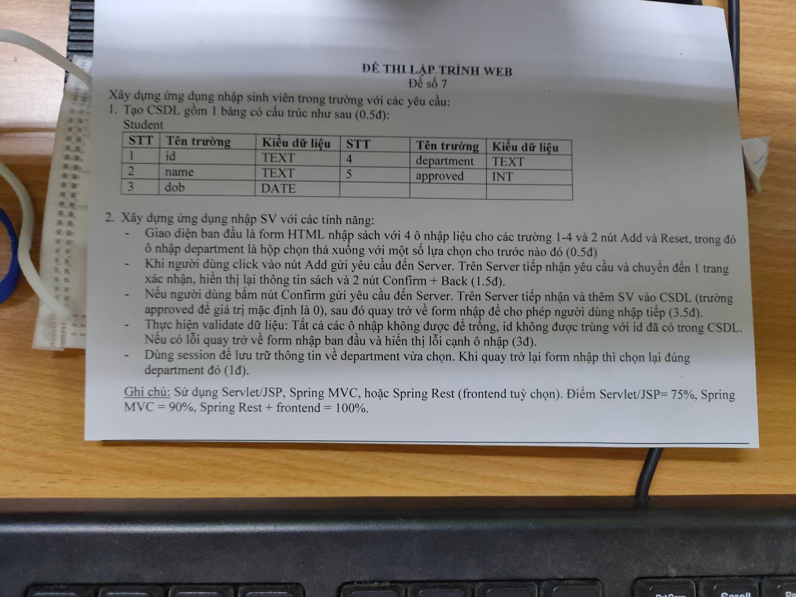

## About
Web Development > Final Exam > No.7

## Built With
* [![Java][Java-shield]][Java-url]
* [![Spring][Spring-shield]][Spring-url]
* [![Apache Maven][Apache Maven-shield]][Apache Maven-url]
* [![Apache Tomcat][Apache Tomcat-shield]][Apache Tomcat-url]
* [![HTML5][HTML5-shield]][HTML5-url]
* [![Thymeleaf][Thymeleaf-shield]][Thymeleaf-url]
* [![MySQL][MySQL-shield]][MySQL-url]

## Requirements

    

<!-- MARKDOWN LINKS & IMAGES -->
<!-- Tech stack -->
[Java-shield]: https://img.shields.io/badge/Java-ED8B00?style=for-the-badge&logo=java&logoColor=white
[Java-url]: https://www.java.com/
[Spring-shield]: https://img.shields.io/badge/spring-%236DB33F.svg?style=for-the-badge&logo=spring&logoColor=white
[Spring-url]: https://spring.io/
[Apache Maven-shield]: https://img.shields.io/badge/Apache%20Maven-C71A36?style=for-the-badge&logo=Apache%20Maven&logoColor=white
[Apache Maven-url]: https://maven.apache.org/
[Apache Tomcat-shield]: https://img.shields.io/badge/apache%20tomcat-%23F8DC75.svg?style=for-the-badge&logo=apache-tomcat&logoColor=black
[Apache Tomcat-url]: https://tomcat.apache.org/
[HTML5-shield]: https://img.shields.io/badge/html5-%23E34F26.svg?style=for-the-badge&logo=html5&logoColor=white
[HTML5-url]: https://www.w3.org/html/
[Thymeleaf-shield]: https://img.shields.io/badge/Thymeleaf-%23005C0F.svg?style=for-the-badge&logo=Thymeleaf&logoColor=white
[Thymeleaf-url]: https://www.thymeleaf.org/
[MySQL-shield]: https://img.shields.io/badge/MySQL-005C84?style=for-the-badge&logo=mysql&logoColor=white
[MySQL-url]: https://www.mysql.com/
